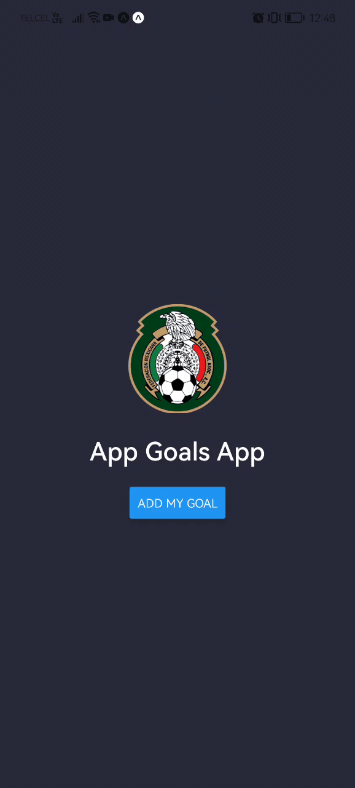
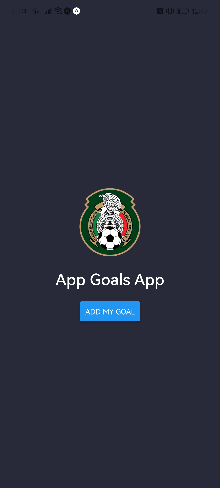
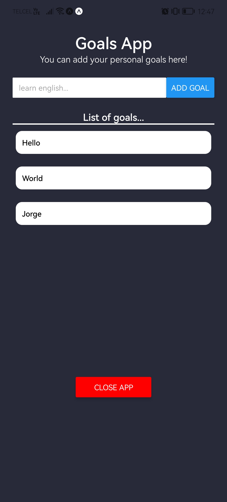

# Goals App.

This is the Goals App where users can add their own goals and delete them by clicking on the goal created.

## Functionality.

A modal will appear at the beginning. Users have to click on the "Add my goal" button to continue and start using this mobile application.

After clicking on the "Close App", the modal will appear again.

## Images.

Here in this section you will find the views created for this mobile app.

  
  

## Tech Stack.

* Javascript.
* React Native.
* Docker.
* Docker Compose.

## Author.

* Jorge Ortiz.
* Software engineer.
* San Luis Potosí S.L.P. México.
